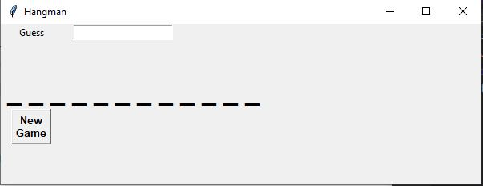
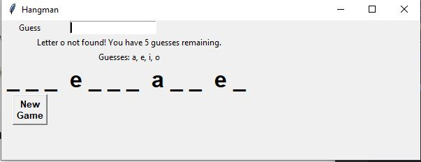
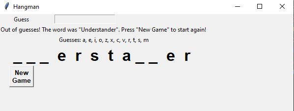
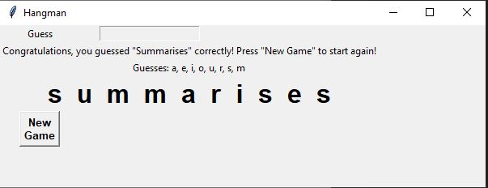

# Hangman
Install Python 3, then run <code>python hangmangui.py</code> in the CLI while in the <code>Hangman</code> directory.

Created with tkinter and OOP.

Simple Hangman game with a GUI that pulls a random word from a text file.

Fresh game: 

Incorrect guess: 

Did not find the word: 

Word was found: 

